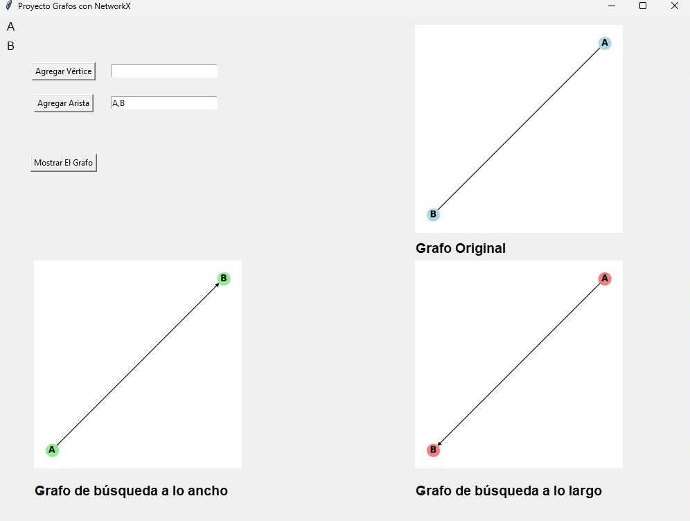
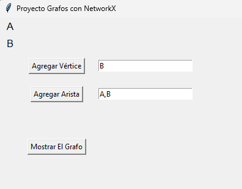
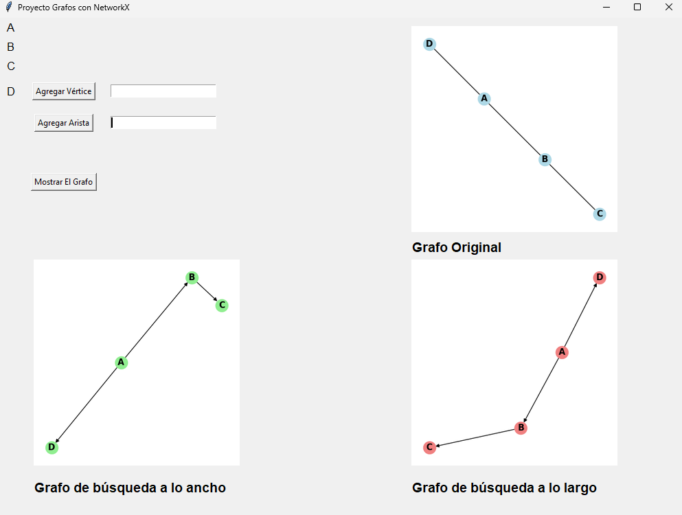
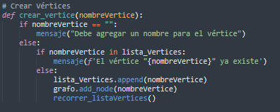
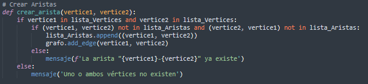
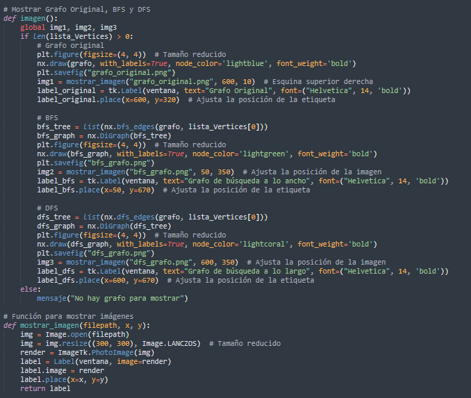
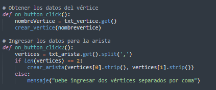
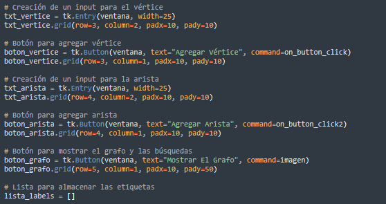

### Manual de Usuario

#### 1. Descripción General

Este programa permite la creación y visualización de grafos interactivos mediante una 
interfaz gráfica sencilla utilizando Tkinter y Graphviz. Los usuarios pueden agregar 
vértices y aristas, y visualizar el grafo resultante en un formato de imagen.

#### 2. Requisitos del Sistema

1. Python 3.x instalado. 
2. *Instalación de las siguientes librerías*:
   - Tkinter (generalmente incluida en Python). 
   - Graphviz. 
   - Pillow para manejar las imágenes.
   Para instalar las dependencias, utiliza:
   - `pip install graphviz pillow`
   - Además, deberás instalar Graphviz en tu sistema y asegurarte de que está configurado en tu PATH. Puedes descargarlo desde [Graphviz.org.](https://graphviz.org)

#### 3. Instalación 

1. Descarga o clona el código desde el repositorio.
2. Asegúrate de tener instaladas todas las dependencias mencionadas. 
3. Ejecuta el archivo Python proyecto.py.

### 4. Interfaz de Usuario

La interfaz está diseñada para ser fácil de usar y consta de las siguientes secciones:
- *Área de Imagen*: Muestra el grafo generado por el usuario.
- *Área de botones*: Se realiza el ingreso de vértices y aristas, también se genera el grafo y los árboles de búsqueda.

#### 5. Uso del Programa

1. *Iniciar el programa*: Abre el programa y espera a que se cargue la interfaz principal.En la parte izquierda de la ventana, verás dos campos de entrada, uno para los vértices y otro para las aristas, junto con un botón para generar el grafo.
   
2. *Ingresar Vértices*: En el campo Vértice, escribe el nombre o valor del vértice que deseas agregar. Presiona Enter o el botón de agregar (si está disponible) para registrar el vértice en el programa. El vértice ingresado se agregará a la lista de vértices mostrada en la sección de resumen a la derecha.

3. *Ingresar Aristas*: En el campo Arista, ingresa la conexión entre dos vértices en el formato A,B, donde A es el vértice de origen y B es el vértice de destino.
Presiona Enter o el botón de agregar arista para registrar la arista en el programa. La arista ingresada aparecerá en el resumen a la derecha junto con el resto de vértices y aristas ingresados.

4. *Mostrar el Grafo*: Una vez que hayas ingresado todos los vértices y aristas necesarios, haz clic en el botón Mostrar el Grafo. El grafo original se mostrará en  la pantalla, mostrando los vértices y las conexiones tal como las ingresaste.

5. *Aplicar el Algortimo de búsqueda de anchura o largo*:
   En el lado izquierdo abajo de la pantalla, se generará el grafo con el algoritmo de búsqueda en anchura o largo aplicado. Este grafo destacará el orden de los nodos explorados según el algoritmo. Los resultados visuales permitirán comparar el grafo original y el grafo procesado con la búsqueda en anchura.

### Manual Técnico

#### 1. Introducción

Este programa se desarrollo utilizando Python y librerias como networkx y tkinter, está diseñada para crear y visualizar grafos. Su principal función es permitir a los usuarios agregar vértices y aristas, posteriormente mostrar el grafo creado, así como sus representaciones en búsquedas a lo ancho (BFS) y a lo largo (DFS).

#### 2. Estructura General del Programa

La estructura general del código se puede dividir en las siguientes secciones:

1. **Importaciones:** Se importan las bibliotecas necesarias, como Tkinter para la interfaz gráfica, NetworkX para la manipulación de grafos, Matplotlib para la visualización gráfica y PIL para el manejo de imágenes.
2. **Inicialización de Variables:** Se crea un grafo vacío y se inicializan listas para almacenar vértices y aristas. También se preparan variables para las imágenes que se generarán.
3. **Configuración de la Ventana:** Se establece la configuración de la ventana principal de la aplicación, incluyendo el título, dimensiones y posición en la pantalla.
4. **Funciones:**
- *Crear Vértices:* Agrega un vértice al grafo y lo valida.
- *Crear Aristas:* Establece conexiones entre vértices y verifica su existencia.
- *Mostrar Grafo:* Genera y muestra el grafo original, así como sus representaciones en BFS y DFS.
- *Mostrar Imágenes:* Maneja la visualización de imágenes generadas.
- *Obtener Datos de Entrada:* Funciones que se activan al hacer clic en botones para agregar vértices o aristas.
5. **Interfaz de Usuario:** 
- Se crean campos de entrada (Entry) para agregar vértices y aristas.
- Se generan botones para realizar acciones (agregar vértices, agregar aristas, mostrar el grafo).
- Se organiza el diseño con grid() para colocar los elementos en la ventana.
6. **Ejecución de la Aplicación:** Se inicia el bucle principal de la aplicación con `ventana.mainloop()`, que mantiene la ventana abierta y activa.

#### 3. Funcionalidades del Programa

- **Interfaz gráfica en Python (Tkinter)**:
  La interfaz del programa permite realizar el ingreso de vértices y aristas.
- **Análisis Networkx**: 
   Permite el análisis para la creación y manipulación de grafos.
  
##### 3.1. Tkinter
Tkinter es la biblioteca estándar de Python para crear interfaces gráficas de usuario (GUI). Proporciona un conjunto de herramientas que permiten colocar ventanas, botones, menús, cuadros de texto y otros elementos visuales.

##### 3.2. Networkx
NetworkX es una biblioteca de Python diseñada para la creación, manipulación y estudio de la estructura, dinámica y funciones de grafos y redes complejas.

#### 4. Manejo de Errores

El programa proporciona un manejo de errores durante su ejecución.

Todos los errores encontrados se listan en el área de errores de la interfaz gráfica, permitiendo al usuario corregir rápidamente el archivo de entrada.

#### 5. Anexos

### Interfaz del usuario

### Grafo y árboles generados

### Función para crear vértice

### Función para crear arista

### Función para mostrar el grafo y los árboles de búsqueda

### Función para ingreso de vértices y aristas

### Interfaz gráfica

